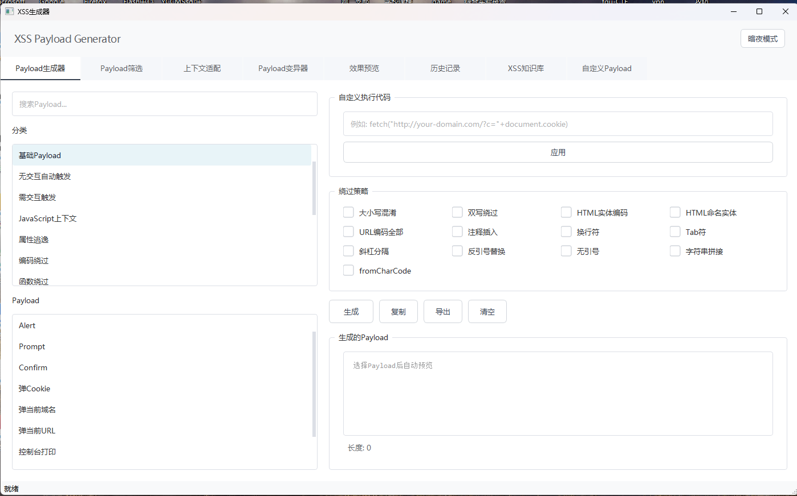
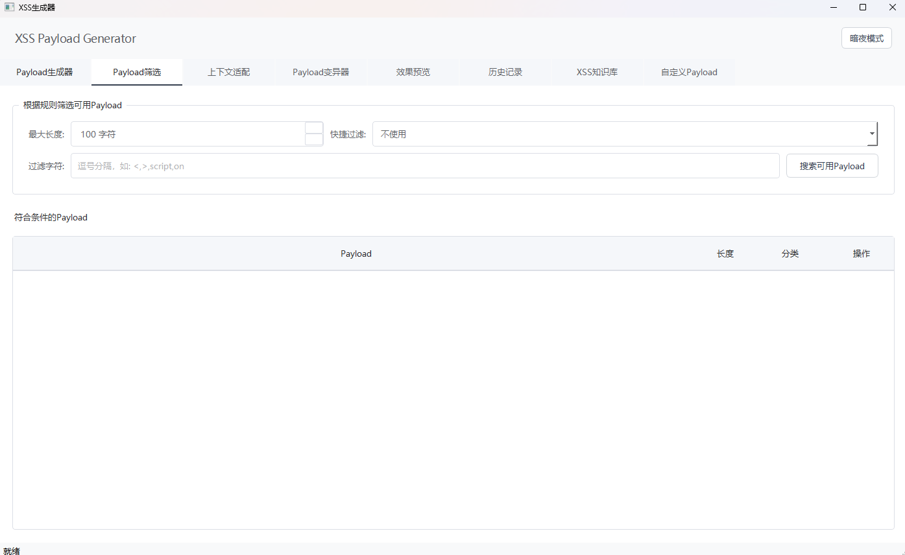
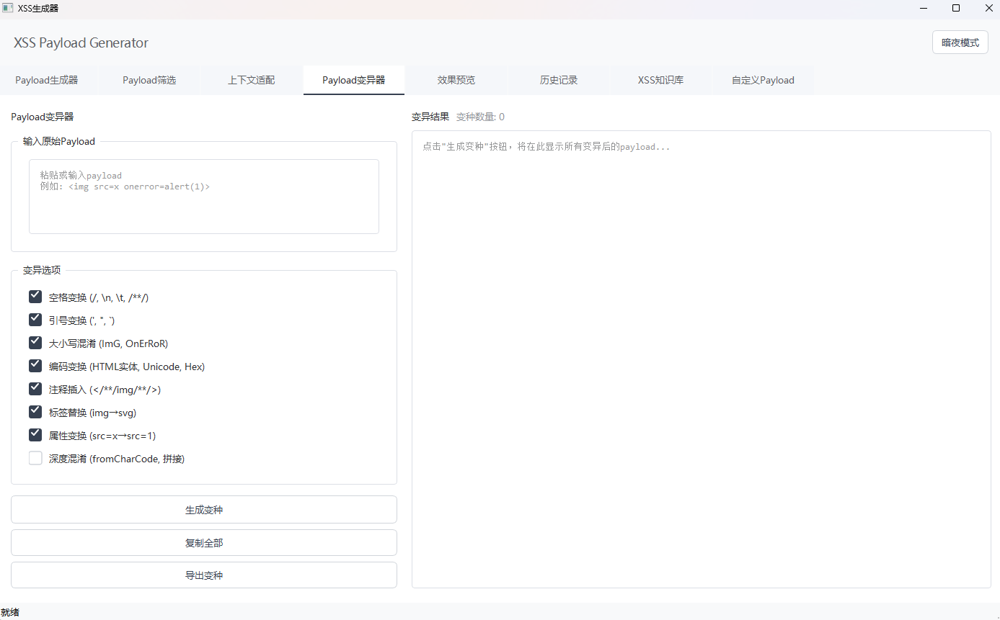
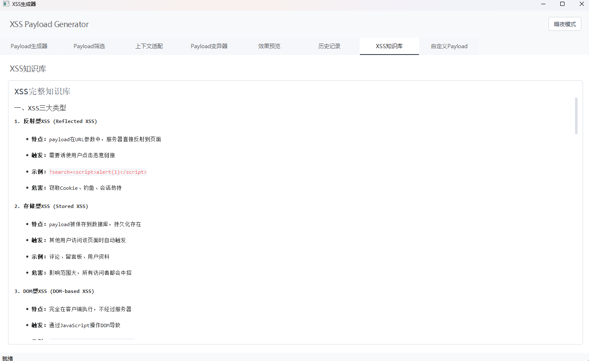
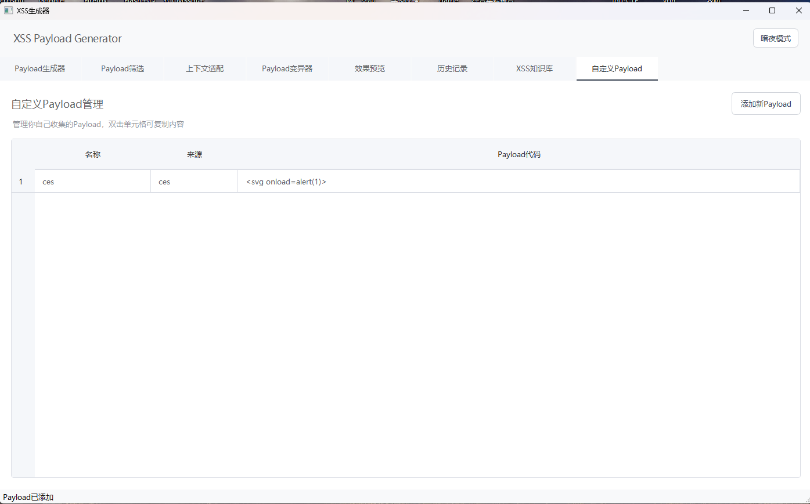

<h1 align="center">XSS Payload Generator</h1>

<p align="center">
  <strong>A powerful XSS payload generator for security researchers</strong>
</p>

<p align="center">
  
  
  
  
  
</p>

<p align="center">
  一款基于 PyQt5 的跨站脚本（XSS）Payload 生成器桌面工具，专为安全测试人员设计。<br>
  提供 Payload 生成、筛选、上下文适配、变异、效果预览等功能，支持多种 WAF 绕过策略。
</p>

---

## 功能特性

| 功能 | 说明 |
|:---|:---|
| **Payload 生成器** | 12 个分类、数百条 Payload，支持 13 种绕过策略（大小写混淆、双写绕过、HTML 实体编码、URL 编码、注释插入、换行符/制表符、反引号、字符串拼接、fromCharCode 等） |
| **Payload 筛选** | 按长度上限和被禁字符/关键词筛选，内置常见 WAF 规则预设 |
| **上下文适配** | 粘贴注入点源码，自动检测注入上下文（HTML 属性、JS 字符串、URL、textarea、注释、模板字面量），推荐适配 Payload |
| **Payload 变异器** | 对单条 Payload 生成多种变体（空格变换、引号变换、大小写混合、编码、注释插入、标签替换、深度混淆） |
| **效果预览** | 通过临时 HTML 文件在系统浏览器中渲染 Payload，安全测试效果 |
| **历史记录** | 自动保存已生成的 Payload 至 `xss_history.json` |
| **XSS 知识库** | 内置 XSS 攻击原理与防御知识的 HTML 教学内容 |
| **自定义 Payload** | 用户自管理的 Payload 集合，持久化至 `custom_payloads.json` |
| **主题切换** | 支持浅色 / 暗夜模式一键切换 |

## 截图预览

<details>
<summary><strong>点击展开截图</strong></summary>
<br>

| Payload 生成器 | Payload 筛选 |
|:---:|:---:|
|  |  |

| 上下文适配 | Payload 变异器 |
|:---:|:---:|
|  |  |

| 效果预览 | XSS 知识库 |
|:---:|:---:|
|  |  |

</details>

## 快速开始

```bash
# 克隆仓库
git clone https://github.com/lang-sec/XSS-Payload-Generator.git
cd XSS-Payload-Generator

# 安装依赖
pip install -r requirements.txt

# 运行
python xss_app.py
```

## 使用说明

1. 启动后在 **Payload 生成器** 标签页选择分类和具体 Payload
2. 勾选需要的绕过策略，点击生成
3. 使用 **筛选** 功能根据目标 WAF 规则过滤可用 Payload
4. 使用 **上下文适配** 粘贴目标页面源码，获得针对性推荐
5. 使用 **变异器** 对选定 Payload 生成多种变体
6. 使用 **效果预览** 在浏览器中安全验证 Payload 效果

## 项目结构

```
XSS-Payload-Generator/
├── xss_app.py                 # 主入口
├── requirements.txt           # 第三方依赖
├── xss_payload_generator.py   # Payload 数据库 + 绕过/变异/验证逻辑
├── icons.py                   # SVG 图标定义
├── custom_checkbox.py         # 自定义复选框控件
├── themes.py                  # 浅色/暗夜主题配色与全局样式
├── knowledge_content.py       # 知识库 HTML 内容生成
├── core/
│   └── payload_manager.py     # Payload 加载/筛选/管理核心逻辑
└── gui/
    ├── main_window.py         # 主窗口 + main() 启动函数
    ├── generator_tab.py       # Payload 生成器标签页
    ├── filter_tab.py          # Payload 筛选标签页
    ├── context_tab.py         # 上下文检测标签页
    ├── mutator_tab.py         # Payload 变异器标签页
    ├── preview_tab.py         # 效果预览标签页
    ├── custom_tab.py          # 自定义 Payload 标签页
    ├── history_tab.py         # 历史记录标签页
    └── knowledge_tab.py       # XSS 知识库标签页
```

## 依赖说明

| 库 | 版本 | 用途 |
|:---|:---|:---|
| PyQt5 | >= 5.15.0 | GUI 框架 |
| PyQt5-sip | >= 12.13.0 | PyQt5 SIP 绑定支持 |

其余均为 Python 标准库。

## 免责声明

> 本工具仅供合法授权的安全测试和教育学习使用。使用者应确保在获得明确授权的情况下对目标系统进行测试。开发者不对因滥用本工具而导致的任何非法行为承担责任。

## 许可证

本项目基于 [MIT License](LICENSE) 开源。
